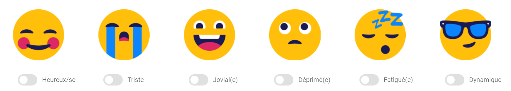

# Projet - APPLICATION WEB MOBILE E-SANTE
# Dans le cadre du cours de Technologies du web pour l'innovation. 

## Avant de commencer à utiliser l'application, il est nécessaire de s'assurer que les dépendances ont été installées et que les plugins l'ont été également.
### Installation des dépendances

```
npm install
```

ou

```
yarn install
```

## Paramètres du lancement du projet
### Compilations et recharges à chaud pour le développement
```
yarn serve
```

### Compilation et miniaturisation pour la production
```
yarn build
```

### Analyse statique du code
```
yarn lint
```

### Personnaliser la configuration
See [Configuration Reference](https://cli.vuejs.org/config/).

## Petits mots sur notre sujet
Cette application regroupe des informations données par l'utilisateur et des informations recueillies par des objets connectés. Nous voulions nous axer sur l'aspect psychologique de la personne. Pour cela, nous avons mixé l'aspect "e-santé", avec des objectifs physiques et alimentaires, et l'aspect plutôt "psychologique/bien-être". Nous proposons à l'utilisateur de se demander comment il se sentait et en lui donnant accès à des ressources en ligne, ou en lui faisant simplement des recommandations, afin d'améliorer son bien-être.

## Petits mots sur chacune des pages du site
### Accueil (Home.vue)
La page Accueil est accessible à tous, sans obligatoirement être inscrit sur notre site. Elle est donc en mode "public". 
Les autres pages sont plutôt "privées", il faut donc s'inscrire pour y accéder.   

### Connexion / Inscription (SignIn.vue / SignUp.vue)
Ces deux pages sont également accessibles de manière "public" et permettent à l'utilisateur de s'inscrire ou de se connecter s'il possède déjà un compte. 
En fonction de la manière dont sont créées les données, il est nécessaire de ne pas créer deux utilisateurs avec le même nom. De plus, le nom ne doit pas contenir de caractères spéciaux tels que ("/") et ne doit pas commencer par un point.

Lorsque l'utilisateur a terminé son inscription et qu'il a validé, un message (snack-bar) s'affiche pour l'informer de la bonne inscription, mais il reste sur le formulaire après validation. L'utilisateur inscrit peut donc retourner sur la page Accueil (par exemple) pour commencer sa navigation.

### Tableau de bord (Dashboard.vue)
Cette page correspond au tableau de bord de l'utilisateur (pour les utilisateurs ayant un compte uniquement) et concerne la journée en cours. 
L'utilisateur peut entrer des données le concernant et ainsi suivre ses objectifs quotidiens, entre autres.

- Dans l'onglet <strong>"Objectifs quotidiens"</strong>, l'utilisateur peut saisir sa progression quant aux objectifs qu'il s'est fixé. L'utilisateur peut les modifier dans les paramètres, ce qui va mettre à jour le tableau de bord. En ce qui concerne les pas effectués, il s'agit d'une donnée retransmise par la montre normalement, donc actuellement la donnée affichée dans le tableau de bord est une valeur aléatoire. Pour les trois autres objectifs, l'utilisateur peut entrer les valeurs qui correspondent à sa consommation d'eau, de calories et à son temps personnel, ce qui met à jour dynamiquement la page. De cette manière, l'utilisateur peut visualiser ce qu'il lui reste à faire pour atteindre ses objectifs.
- Dans l'onglet <strong>"Activité physique du jour"</strong>, l'utilisateur peut mesurer son rythme cardiaque, en supposant que sa montre soit connectée pour qu'elle puisse le mesurer. A chaque fois qu'il appuie sur le coeur, ça reprend son rythme cardiaque. Dans le cadre de ce projet, comme nous n'avons pas réellement connecté la montre de l'utilisateur, il s'agit bien évidemment de valeurs fictives et cette carte du rythme cardiaque fait office de simulation. Il peut ensuite choisir un sport qu'il aurait pratiqué dans la journée et l'enregistrer. Cette donnée apparaitra ensuite dans la base de données, une fois qu'il aura validé.
- Dans l'onglet <strong>"Sommeil"</strong>, l'utilisateur accède aux données enregistrées par sa montre sur l'état de son sommeil pour la nuit qu'il vient de passer. Il peut également renseigner la qualité et la quantité de celui-ci, données qui seront enregistrées dans la base de données, afin de nous aiguiller sur son état de fatigue et lui donner un historique sur le mois de son sommeil.
- Dans l'onglet <strong>"Humeur"</strong>, l'utilisateur peut saisir son humeur et ainsi avoir une recommandation de film à regarder, en fonction de comment il se sent.


### Historique (Master.vue)
La page Historique amène à un calendrier visible par mois ou par jour. L'utilisateur peut choisir d'afficher des détails concernant un mois entier ou un jour en particulier, et ce, en choisissant la date, puis en cliquant sur le bouton "Accéder".

### Pages des détails (DetailsMois.vue / DetailsJour.vue)
Ces pages, comme leurs noms l'indiquent, donnent les détails concernant l'utilsateur par mois ou par jour. Comme il s'agit d'historiques, ces pages ne sont pas modifiables, contrairement au tableau de bord. Elles ne sont également accessibles que si l'utilisateur a un compte et qu'il est connecté.  

Pour la page des <strong>détails pour un jour</strong>, elle est similaire à la page du tableau du bord, mais n'est simplement pas dynamique comme il s'agit d'un historique. De ce fait, dans l'onglet "Humeur", seul des films, recommandés pour l'utilisateur, sont affichés.

En ce qui concerne la page des <strong>détails des mois</strong>, il y a quatre onglets. 
- Dans l'onglet <strong>"Général"</strong>, l'utilisateur peut voir un résumé des humeurs qu'il a rentré au cours du mois et voir le poids (avec l'IMC correspondant) qu'il avait. Il peut également avoir accès à des livres sur le bien-être (qu'il peut acheter en ligne) et à des citations. 
- Dans l'onglet <strong>"Sommeil"</strong>, il peut revoir via des graphiques l'historique de son sommeil pour le mois sélectionné. 
- Dans l'onglet <strong>"Alimentation"</strong>, il peut revoir en détail sa consommation d'eau, de protéines, de glucides, etc., pour le mois sélectionné. Des articles en rapport avec l'alimentation lui sont également proposés sur cette onglet. 
- Pour l'onglet <strong>"Sport"</strong>, il a, de la même manière, un résumé concernant ses activités physiques. Il peut voir le nombre de pas effectués, les calories brûlées, le nombre total d'heures en activité effectuées, s'il a atteint son objectif mensuel, et enfin il peut visualiser ses quatre sports préférés.

### Paramètres (Parameters.vue)
Correspond à la page des paramètres du compte et des objectifs de l'utilisateur (il peut y modifier ses données). 
Ainsi, lorsque l'utilisateur modifie ses objectifs (premier onglet), cela met à jour les objectifs dans le tableau de bord.

Ensuite, lorsque l'utilisateur souhaite modifier ses informations personnelles, il peut uniquement modifier son mot de passe. Ce changement ne le déconnecte pas, mais la prochaine fois qu'il souhaitera se connecter, il devra utiliser le nouveau mot de passe.
Celui-ci n'est pas immédiatement effectif et nécessite un temps de mise à jour.

## Test de l'application 
### Connexion / Inscription
Au moment de l'inscription : 
- Vérifiez que le nom d'utilisateur rentré respecte des règles de base (comme détaillé ci-dessus).
- Vérifiez que, dans le cas où l'adresse mail n'est pas dans un format correct, un message d'erreur s'affiche.
- Vérifiez que le mot de passe soit analysé par le site, et donc qu'il soit d'un minimum de huit caractères, et que sa confirmation soit identique.
- Vérifiez, lorsque tous les champs sont remplis, que le bouton "Valider" devienne cliquable. 
- Vérifiez qu'un message de type "snack-bar" s'affiche lorsque vous cliquez que le bouton "Valider". 

Pour la connexion : 
- Si l'adresse mail et/ou le mot de passe est/sont invalide(s), la connexion aura échoué. Mais vérifiez que la connexion a été faite (ou non) en essayant d'accéder à une page "privée". Si l'accès à l'une de ces pages est possible alors que l'accueil n'affichait pas que vous étiez connecté, revenez sur la page Accueil pour constater que la connexion a réussi. Si l'accès à ces pages est impossible, alors la connexion n'a pas pu se faire, à cause d'une erreur dans le mail et/ou le mot de passe.

### Accueil
Pour la section "Actualités" : 
- Vérifiez que les cinq images s'affichent et défilent. 

Pour la section "A propos de nous" : 
- Vérifiez que des messages de type "pop-up" s'affichent lorsque vous cliquez sur les boutons "En savoir plus sur ...".

### Tableau de bord
- S'assurer que la date affichée est bien celle du jour même.

Pour l'onglet "Objectifs Quotidiens" :
- Vérifier, pour chaque carte, si "Objectif de ..." est bien renseigné.
- Vérifier qu'un nombre aléatoire entre 0 et 4000 apparaît pour le nombre de pas effectués (c'est une donnée fictive et aléatoire).
- Vérifier que le nombre de pas restant correspondant bien à la différence entre l'objectif et le nombre de pas effectués.
- Dans la section "A toi de nous dire...", cliquer sur l'icône bleue de l'eau et ajouter un nombre de verres ayant été bu dans la journée. Ce nombre doit s'ajouter à la carte de l'eau et la différence entre l'objectif et ce nombre doit également apparaître. Si le nombre choisit est supérieur à l'objectif, la deuxième phrase change pour féliciter l'utilisateur.
- Cliquer sur l'icône rose des calories. Ajouter un nombre de calories consommées et vérifier que la carte des calories s'est actualisée comme les précédentes (nombre + différence).  A nouveau, si le nombre choisit est supérieur à l'objectif, des félicitations apparaissent.
- Cliquer ensuite sur l'icône violette du temps personnel et ajouter, à nouveau, un temps personnel. La carte reliée doit s'actualiser (nombre choisit + différence). De même, si l'objectif est atteint, l'utilisateur est félicité.
- Chacune de ces modifications fait apparaître un message de type "snack-bar" pour informer l'utilisateur du succès de son action.

Pour l'onglet "Activité physique du jour" :
- Cliquer sur le petit cœur dans la carte de la fréquence cardiaque. De manière aléatoire, celui-ci affiche un nombre de battements par minute (BPM).
- Dans la catégorie suivante, choisissez des sports et cliquer sur le bouton "Ajouter les sports sélectionnés". Un message de type "snack-bar" s'affiche, en bas de l'écran pour signaler la validation de l'action.

Pour l'onglet "Sommeil" :
- Un graphique s'affiche pour montrer les phases du sommeil, pendant la nuit qui vient de passer.
- En dessous du graphique, deux questions sont posées à l'utilisateur. La première lui demande quelle était la qualité de son sommeil. Tandis que la seconde lui demande quelle était la quantité de celui-ci. Il a le choix entre plusieurs réponses possibles. Après avoir rempli ces deux questions, cliquer sur le bouton "Ajouter ma sélection" et vérifier qu'un message de type "snack-bar" s'affiche pour valider la modification.

Pour l'onglet "Humeur" :
- Si l'utilisateur sélectionne les humeurs "heureux", "jovial" ou "dynamique", une liste de quatre films apparaît. S'il a sélectionné les humeurs "triste", "déprimé ou "fatigué", une liste de quatre autres films apparaît. Ce sont des recommandations. Elles n'impactent pas les données. L'utilisateur peut donc valider sa sélection en cliquant sur le bouton "Ajouter ma sélection". Vérifier qu'un message de type "snack-bar" apparaît pour valider l'envoi des données.

### Historique / Pages des détails
Pour la page des calendriers : 
- Vérifiez que les deux calendriers s'affichent, en version "mois" lorsque vous êtes sur l'onglet "Vue annuelle" (vue sur tous les mois), et en version "jours" (vue sur un mois complet) lorsque vous êtes sur l'onglet "vue mensuelle".
- Vérifiez que le bouton "Accéder" amène à la bonne page des détails, selon le calendrier affiché. 

Pour la page des détails du mois sélectionné : 
- Vérifiez que le mois affiché correspond au mois sélectionné.
- Vérifiez, dans l'onglet "Général", que les images des livres de la section "Liens" et des citations dans la section "Citations" apparaissent.
- Vérifiez, dans l'onglet "Sommeil", que les graphiques s'affichent. 
- Vérifiez, dans l'onglet "Alimentation", que les barres de progression dans la section "Ma nourriture" s'affichent correctement. Ne pas cliquer sur ces barres car elles sont modifiables et ce n'était pas l'objectif.
- Vérifiez dans ce même onglet, que les articles s'affichent correctement. 
- Vérifiez, dans l'onglet "Sport", que les images et le graphique s'affichent correctement.
Pour la page des détails d'une journée sélectionnée : 
- Vérifiez que le jour affiché correspond au jour sélectionné. 
- Vérifiez, dans l'onglet "Objectifs quotidiens", que des valeurs correspondant aux objectifs, aux valeurs de ce qui a été atteint et aux valeurs de ce qui reste pour atteindre l'objectif, s'affichent. 
- Vérifiez, dans l'onglet "Activité physique du jour", que des valeurs pour le tour en vélo soient renseignées et que rien ne soit renseigné aux autres activités, et que l'image en bas de page s'affiche également.
- Vérifiez, dans l'onglet "Sommeil", que le graphique sur le sommeil de la nuit précédente s'affiche, avec le GIF correspondant. 
- Vérifiez, dans l'onglet "Humeur", que les affiches de films s'affichent et que le lien pour accéder à une liste de professionnel amène bien à un site externe (source : https://sante.lefigaro.fr/tags/professionnels-sante).

### Paramètres
Pour l'onglet "Mon profil" :
- Dans la catégorie "Mes objectifs quotidiens", les objectifs sont représentés. Par défaut, des valeurs ont  été attribués à l'inscription (10 000 pas, 10 verres d'eau, 2 000 calories et 90 minutes de temps personnel). Vérifier que ce sont ces valeurs qui sont affichées.
- Vous pouvez ensuite les modifier. Inscrire un nouvel objectif de pas à effectuer et cliquer sur le bouton "Ok" au bout de sa ligne. Faites la même chose avec les autres objectifs. A chaque fois, un message de type "snack-bar" s'affiche pour valider la modification.
Une fois terminé, cliquer sur "Terminer" et vérifier que les valeurs affichées correspondent à celles qui ont été saisies.
- Dans la catégorie "Mes appareils", il ne sert à rien de cliquer sur "Ajouter un appareil" ou "Supprimer un appareil", ces liens sont inactifs. Pour ce qui est de l'appareil connecté, l'utilisateur voit que son appareil est mis à jour toutes les heures, par défaut. En cliquant sur le bouton "Modifier", il peut changer ce paramètre. Faites un changement sur 3 heures et vérifier, après avoir cliquer sur le bouton "Terminer" que le changement est effectif.
Pour l'onglet "Mes informations personnelles" :
- L'utilisateur peut voir ces informations, comme son pseudo, son adresse mail et la date à laquelle il s'est inscrit. Il peut également modifier des informations telles que le mot de passe. Pour cela, cliquer sur le bouton "Modifier" et saisir un nouveau mot de passe. Le changement n'étant pas effectif, il n'est pas possible de vérifier directement. Cliquer sur "Terminer".

### De manière générale 
- Le nom de la page "Healthink" est un lien permanent vers la page d'accueil.
- Toutes les flèches " < " à côté des titres permettent de revenir à la page précédente (l'accueil pour la plupart et l'historique pour DetailsJour et DetailsMois).
- Le bouton "Déconnexion" permet de se déconnecter. Si l'utilisateur le fait alors qu'il est sur une page "privée", un nouveau contenu s'affiche pour lui dire de s'inscrire. Il n'a donc plus accès aux contenus "privés".


#### Amélie DELAIN, Cynthia LAURENT et Clara SCHOTT
Etudiantes en M1 Sciences Cognitives

Institut des Sciences du Digital, Management et Cognition (IDMC)


